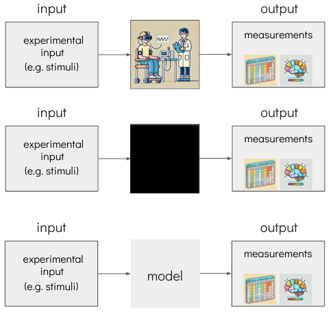

```{r render-setup}
# Runs at render time – provides data/functions for static slides
source("R/setup.R")
```

```{r shiny-setup}
#| context: server
#| include: false
# Defines shared data and functions for all reactive Shiny chunks
source("R/setup.R")
```


# Section objectives {.section-title background-color="#2c3e50"}


---

## Session objectives

::: {.objective-list}

1. Introduce the **idea** of modelling — why is it helpful?
2. Introduce the **key components**: model, free parameters, data
3. **Specifying** a model — intuition and R code
4. **Fitting** a model — cost functions and optimisation
5. **Comparing** models — AIC, BIC, cross-validation
6. **Quality controls** — models are not magic
7. **Further topics** — where to go next

:::

---

# Section 1: Introduction {.section-title background-color="#2c3e50"}

---

## What is computational modelling?

:::: {.columns}
::: {.column width="58%"}

**The problem:** many constructs in psychology are not directly observable

- Beliefs, attention, value representations, decision strategies …

<br>

**The promise:** a computational model formalises *how* a cognitive process
might work, letting us infer **unobservable** quantities from observable behaviour.

<br>

::: {.key-concept}
A computational model is a **mathematical description of a process** that
generates observable behaviour.
Its **parameters** capture individual differences in that process.
:::

:::
::: {.column width="42%"}

{width="100%"}

:::
::::

---

## Models as formalised hypotheses

:::: {.columns}
::: {.column width="52%"}

A model is more than a description — it is a **testable hypothesis**

1. **Formalise** your hypothesis as a model
2. **Fit** the model to data → estimate parameters
3. **Compare** models — which fits the data best?

<br>

::: {.key-concept}
Think of models as **keys** and data as a **lock**.
The best key is the one that opens the lock most efficiently —
it fits the data *and* does not over-engineer the mechanism.
:::

:::
::: {.column width="48%"}

```{r keys-plot}
#| fig-height: 4.5
df_keys <- data.frame(
  model = c("Model A\n(simple)", "Model B\n(complex)", "Model C\n(wrong)", "Model D\n(moderate)"),
  fit   = c(0.94, 0.97, 0.31, 0.78),
  best  = c(TRUE, FALSE, FALSE, FALSE)
)
ggplot(df_keys, aes(x = model, y = fit, fill = best)) +
  geom_col(width = 0.6, colour = "white", linewidth = 1) +
  geom_text(aes(label = sprintf("fit=%.2f", fit)), vjust = -0.4, size = 4.5) +
  scale_fill_manual(values = c("FALSE" = "#aaaaaa", "TRUE" = COL_MODEL), guide = "none") +
  scale_y_continuous(limits = c(0, 1.12), breaks = NULL,
                     name = "How well the key fits →") +
  labs(x = NULL, title = "Which model fits the data best?") +
  theme_pres()
```

:::
::::

---

## A familiar example: Rescorla–Wagner

:::: {.columns}
::: {.column width="52%"}

One of the most influential models in learning theory:

$$\boxed{V(t+1) = V(t) + \alpha \cdot \underbrace{\bigl(R(t) - V(t)\bigr)}_{\delta(t)\ \text{prediction error}}}$$

<br>

| Symbol | Meaning |
|--------|---------|
| $V(t)$ | Expected value (belief) at trial $t$ |
| $R(t)$ | Reward received at trial $t$ |
| $\alpha \in (0,1)$ | Learning rate — **free parameter** |
| $\delta(t) = R(t) - V(t)$ | Prediction error |

:::
::: {.column width="48%"}

::: {.key-concept}
**Intuition:** update in proportion to how surprised you were.

- $\alpha \approx 0$ → slow learner, retains history
- $\alpha \approx 1$ → fast learner, ignores history
:::

<br>

Despite its simplicity, RW captures:

- Acquisition & extinction
- Blocking & overshadowing
- Value-based decision making
- Neural correlates in dopamine neurons

:::
::::

---

# Section 2: Key components {.section-title background-color="#2c3e50"}

---

## The three pillars

```{r three-pillars}
#| fig-height: 3.5
df_p <- data.frame(
  x     = c(1.5, 4.5, 7.5),
  label = c("DATA", "MODEL", "FREE PARAMETERS"),
  desc  = c(
    "What the participant did\n(trial-by-trial responses, RTs …)",
    "Mathematical process\nthat generates behaviour",
    "Numbers that tune the model\nto an individual (e.g. α)"
  ),
  fill  = c("#3d5a7a", "#5a7a3d", "#7a3d5a")
)
ggplot(df_p) +
  geom_tile(aes(x, y = 1, fill = I(fill)),
            width = 2.4, height = 0.9, colour = "white", linewidth = 2) +
  geom_text(aes(x, y = 1.15, label = label),
            colour = "white", fontface = "bold", size = 5.5) +
  geom_text(aes(x, y = 0.85, label = desc),
            colour = "white", size = 3.8, lineheight = 1.25) +
  annotate("segment", x = 2.72, xend = 3.28, y = 1, yend = 1,
           arrow = arrow(ends = "both", length = unit(0.28, "cm")),
           colour = "#555555", linewidth = 1.5) +
  annotate("segment", x = 5.72, xend = 6.28, y = 1, yend = 1,
           arrow = arrow(ends = "both", length = unit(0.28, "cm")),
           colour = "#555555", linewidth = 1.5) +
  xlim(0.1, 9) + ylim(0.4, 1.6) +
  theme_void()
```

<br>

:::: {.columns}
::: {.column width="33%"}
Data are what the participant **actually did**.
At what level do you fit? Trial-by-trial vs. summary statistics?
:::
::: {.column width="33%"}
A model **generates predictions** given parameters and the task structure.
:::
::: {.column width="33%"}
Parameters capture **individual differences** — we estimate them from data.
:::
::::

---

## The data: a reward prediction task

```{r data-plot}
#| fig-height: 5.5
df_data <- data.frame(trial = trials, reward = outcomes, rating = participant_ratings)

ggplot(df_data, aes(x = trial)) +
  geom_vline(xintercept = reversal_x,
             linetype = "dashed", colour = "#cccccc", linewidth = 0.9) +
  geom_point(aes(y = reward, colour = "True reward"), size = 2.8, alpha = 0.85) +
  geom_line(aes(y = rating, colour = "Participant prediction"), linewidth = 1.2) +
  scale_colour_manual(
    values = c("True reward" = COL_REWARD, "Participant prediction" = COL_PARTICIPANT)
  ) +
  annotate("text", x = c(10, 30, 50, 70), y = 100,
           label = paste("Block", 1:4), size = 4.5, colour = "#666666", fontface = "bold") +
  scale_x_continuous(breaks = seq(0, 80, 20)) +
  scale_y_continuous(limits = c(0, 104), breaks = seq(0, 100, 25)) +
  labs(x = "Trial", y = "Value (0–100)",
       title = "Reward prediction task",
       subtitle = "On each trial the participant predicts the reward they will receive next") +
  theme_pres()
```

::: {.caption}
[**● True reward**]{style="color:#DC143C"} &emsp; [**— Participant prediction**]{style="color:#001F5B"} &emsp; | Dashed lines = reversals
:::

---

## What is a model?

:::: {.columns}
::: {.column width="55%"}

A model is a **function**:

$$\underbrace{\text{Task data}}_{\text{reward schedule}} + \underbrace{\text{Parameters}}_{\alpha,\, v_0,\, \ldots} \;\longrightarrow\; \underbrace{\text{Predictions}}_{V(1),\, V(2),\, \ldots,\, V(T)}$$

<br>

Models are **generative** — they describe a process that *could have*
produced the observed data. Fitting parameters finds the process most
consistent with what we observed.

<br>

::: {.key-concept}
The key question: **how probable are the observed data under this model
and these parameters?**

This is the likelihood — $P(D \mid \theta, M)$.
:::

:::
::: {.column width="45%"}

```{r model-diagram}
#| fig-height: 4
df_m <- data.frame(
  x     = c(1, 3.5, 6),
  y     = c(1, 1, 1),
  label = c("Task data\n+ Parameters", "Model\n(update rule)", "Predictions\nV(t)"),
  fill  = c("#3d5a7a", "#5a7a3d", COL_MODEL)
)
ggplot(df_m) +
  geom_tile(aes(x, y, fill = I(fill)),
            width = 1.6, height = 0.65,
            colour = "white", linewidth = 2) +
  geom_text(aes(x, y, label = label), colour = "white",
            fontface = "bold", size = 5, lineheight = 1.25) +
  annotate("segment", x = 1.82, xend = 2.68, y = 1, yend = 1,
           arrow = arrow(length = unit(0.3, "cm")),
           colour = "#555555", linewidth = 1.4) +
  annotate("segment", x = 4.32, xend = 5.18, y = 1, yend = 1,
           arrow = arrow(length = unit(0.3, "cm")),
           colour = "#555555", linewidth = 1.4) +
  xlim(0, 7) + ylim(0.4, 1.8) +
  theme_void()
```

:::
::::

---

## Free parameters: interactive exploration

**What does the learning rate $\alpha$ actually do?** Move the slider.

```{r app1-ui}
sliderInput("alpha_1", label = "Learning rate α",
            min = 0, max = 1, value = 0.3, step = 0.01, width = "600px")
plotOutput("app1_plot", height = "560px")
```

```{r app1-server}
#| context: server
output$app1_plot <- renderPlot({
  preds <- rw1(outcomes, input$alpha_1)
  df <- data.frame(trial = trials, reward = outcomes, prediction = preds)
  ggplot(df, aes(x = trial)) +
    geom_vline(xintercept = reversal_x, linetype = "dashed",
               colour = "#cccccc", linewidth = 0.9) +
    geom_point(aes(y = reward), colour = COL_REWARD, size = 2.8, alpha = 0.85) +
    geom_line(aes(y = prediction), colour = COL_MODEL, linewidth = 1.6) +
    scale_y_continuous(limits = c(0, 104), breaks = seq(0, 100, 25)) +
    scale_x_continuous(breaks = seq(0, 80, 20)) +
    labs(x = "Trial", y = "Value (0–100)",
         title    = sprintf("Model predictions  |  α = %.2f", input$alpha_1),
         subtitle = "Red dots = true reward   |   Turquoise line = model prediction") +
    theme_pres(16)
}, res = 110)
```

---

# Section 3: Specifying a model {.section-title background-color="#2c3e50"}

---

## Mathematical specification

:::: {.columns}
::: {.column width="50%"}

### Linear regression

$$\hat{y} = \beta_0 + \beta_1 x_1 + \cdots + \beta_k x_k$$

$$y \sim \mathcal{N}(\hat{y},\; \sigma^2)$$

- Inputs: predictors $x_1, \ldots, x_k$
- Free parameters: $\beta_0, \ldots, \beta_k$
- Observation model: Gaussian noise

:::
::: {.column width="50%"}

### Rescorla–Wagner (RW₁)

$$V(t+1) = V(t) + \alpha \cdot (R(t) - V(t))$$

$$y_t \sim \mathcal{N}(V_t,\; \sigma^2)$$

- Input: reward sequence $R(1), \ldots, R(T)$
- Free parameter: $\alpha \in (0, 1)$
- Fixed starting value: $V(1) = 50$
- Observation model: Gaussian noise

:::
::::

<br>

::: {.key-concept}
Both share the same structure: **inputs → parameters → predictions → observation model**.
The RW model is regression with memory — it incorporates temporal dynamics.
:::

---

## RW₁ in R: one free parameter

```{r rw1-code}
#| echo: true
#| eval: false
rw1 <- function(data, params) {
  outcomes <- data$outcomes   # reward received on each trial (0–100)
  n_trials <- data$n_trials

  vals    <- numeric(n_trials + 1)
  vals[1] <- 50               # fixed starting value

  for (t in seq_len(n_trials)) {
    pe        <- outcomes[t] - vals[t]    # prediction error
    vals[t+1] <- vals[t] + params$alpha * pe
  }

  list(vals = vals[-1])       # return V(1) … V(T)
}
```

<br>

::: {.key-concept}
**One free parameter:** `alpha` — the learning rate $\in (0,1)$.
`vals[t]` is the model's prediction *before* seeing the outcome on trial $t$.
After observing the outcome, `vals[t+1]` is updated.
:::

---

## RW₂: estimating the starting value

:::: {.columns}
::: {.column width="48%"}

### Adding $v_0$ as a free parameter

$$V(1) = v_0 \quad \text{(now estimated, not fixed)}$$
$$V(t+1) = V(t) + \alpha \cdot (R(t) - V(t))$$

**Free parameters:** $\alpha,\; v_0$

```{r rw2-code}
#| echo: true
#| eval: false
rw2 <- function(data, params) {
  outcomes <- data$outcomes
  n_trials <- data$n_trials

  vals    <- numeric(n_trials + 1)
  vals[1] <- params$v0        # estimated start

  for (t in seq_len(n_trials)) {
    pe        <- outcomes[t] - vals[t]
    vals[t+1] <- vals[t] + params$alpha * pe
  }
  list(vals = vals[-1])
}
```

:::
::: {.column width="52%"}

**Explore both parameters:**

```{r app2-ui}
sliderInput("alpha_2", "Learning rate α",   0,   1, 0.3, 0.01, width = "95%")
sliderInput("v0_2",    "Initial value v₀",  0, 100,  50, 1,    width = "95%")
plotOutput("app2_plot", height = "400px")
```

```{r app2-server}
#| context: server
output$app2_plot <- renderPlot({
  preds <- rw2(outcomes, input$alpha_2, input$v0_2)
  df <- data.frame(trial = trials, reward = outcomes, prediction = preds)
  ggplot(df, aes(x = trial)) +
    geom_vline(xintercept = reversal_x, linetype = "dashed",
               colour = "#cccccc", linewidth = 0.8) +
    geom_point(aes(y = reward), colour = COL_REWARD, size = 2.2, alpha = 0.85) +
    geom_line(aes(y = prediction), colour = COL_MODEL, linewidth = 1.3) +
    scale_y_continuous(limits = c(0, 104)) +
    labs(x = "Trial", y = "Value (0–100)",
         title = sprintf("α = %.2f  |  v₀ = %.0f", input$alpha_2, input$v0_2)) +
    theme_pres(13)
}, res = 110)
```

:::
::::

---

## RW₃: asymmetric learning rates

:::: {.columns}
::: {.column width="50%"}

### Separate $\alpha$ for gains and losses

$$\alpha = \begin{cases}
\alpha_b & \text{if } R(t) - V(t) > 0 \quad \text{(better than expected)} \\
\alpha_w & \text{if } R(t) - V(t) \le 0 \quad \text{(worse than expected)}
\end{cases}$$

**Free parameters:** $\alpha_b,\; \alpha_w,\; v_0$

```{r rw3-code}
#| echo: true
#| eval: false
rw3 <- function(data, params) {
  outcomes <- data$outcomes
  vals     <- numeric(data$n_trials + 1)
  vals[1]  <- params$v0

  for (t in seq_len(data$n_trials)) {
    pe <- outcomes[t] - vals[t]
    a  <- if (pe > 0) params$alpha_b else params$alpha_w
    vals[t+1] <- vals[t] + a * pe
  }
  list(vals = vals[-1])
}
```

:::
::: {.column width="50%"}

```{r app3-ui}
sliderInput("ab_3",  "α_b  (better than expected)",  0, 1, 0.40, 0.01, width = "95%")
sliderInput("aw_3",  "α_w  (worse than expected)",   0, 1, 0.15, 0.01, width = "95%")
sliderInput("v0_3",  "Initial value v₀",             0, 100, 50, 1,    width = "95%")
plotOutput("app3_plot", height = "390px")
```

```{r app3-server}
#| context: server
output$app3_plot <- renderPlot({
  preds <- rw3(outcomes, input$ab_3, input$aw_3, input$v0_3)
  df <- data.frame(trial = trials, reward = outcomes, prediction = preds)
  ggplot(df, aes(x = trial)) +
    geom_vline(xintercept = reversal_x, linetype = "dashed",
               colour = "#cccccc", linewidth = 0.8) +
    geom_point(aes(y = reward), colour = COL_REWARD, size = 2.2, alpha = 0.85) +
    geom_line(aes(y = prediction), colour = COL_MODEL, linewidth = 1.3) +
    scale_y_continuous(limits = c(0, 104)) +
    labs(x = "Trial", y = "Value (0–100)",
         title = sprintf("α_b = %.2f  |  α_w = %.2f  |  v₀ = %.0f",
                         input$ab_3, input$aw_3, input$v0_3)) +
    theme_pres(13)
}, res = 110)
```

:::
::::

---

# Section 4: Fitting a model {.section-title background-color="#2c3e50"}

---

## The cost function: watching errors in real time

**Move the slider — the model predictions and their errors update simultaneously**

:::: {.columns}
::: {.column width="22%"}

```{r app4-ui}
br()
sliderInput("alpha_4", "Learning rate α",
            0, 1, 0.3, 0.01, width = "95%")
br()
strong("Summary statistics:")
br(); br()
verbatimTextOutput("app4_summary")
```

:::
::: {.column width="78%"}

```{r app4-plot-ui}
plotOutput("app4_plot", height = "640px")
```

:::
::::

```{r app4-server}
#| context: server
output$app4_plot <- renderPlot({
  preds  <- rw1(outcomes, input$alpha_4)
  errors <- participant_ratings - preds
  df <- data.frame(trial = trials, reward = outcomes,
                   pred = preds, rating = participant_ratings, error = errors)

  p_top <- ggplot(df, aes(x = trial)) +
    geom_vline(xintercept = reversal_x, linetype = "dashed",
               colour = "#dddddd", linewidth = 0.8) +
    geom_point(aes(y = reward),  colour = COL_REWARD,      size = 2.2, alpha = 0.8) +
    geom_line(aes(y = rating),   colour = COL_PARTICIPANT,  linewidth = 1.0) +
    geom_line(aes(y = pred),     colour = COL_MODEL,        linewidth = 1.4) +
    scale_y_continuous(limits = c(0, 104)) +
    labs(x = NULL, y = "Value (0–100)",
         subtitle = paste0(
           "  ● Reward    ",
           "–– Participant    ",
           "–– Model prediction"
         )) +
    theme_pres(13)

  p_bot <- ggplot(df, aes(x = trial, y = error, fill = error > 0)) +
    geom_hline(yintercept = 0, colour = "#999999", linewidth = 0.8) +
    geom_vline(xintercept = reversal_x, linetype = "dashed",
               colour = "#dddddd", linewidth = 0.8) +
    geom_col(width = 0.8, alpha = 0.8) +
    scale_fill_manual(values = c("TRUE" = "#27ae60", "FALSE" = "#c0392b"),
                      guide = "none") +
    labs(x = "Trial", y = "Error\n(participant − model)") +
    theme_pres(13)

  p_top / p_bot + plot_layout(heights = c(1.8, 1))
}, res = 110)

output$app4_summary <- renderText({
  preds  <- rw1(outcomes, input$alpha_4)
  errors <- participant_ratings - preds
  sprintf(
    "MSE  = %.1f\nRMSE = %.1f\nMAE  = %.1f",
    mean(errors^2), sqrt(mean(errors^2)), mean(abs(errors))
  )
})
```

---

## Cost functions: measuring fit

::: {.key-concept}
**A model is nothing without a cost function.**
The cost function quantifies *how wrong* the model is — and guides parameter estimation.
:::

<br>

| Cost function | Formula | Notes |
|---------------|---------|-------|
| Sum of errors | $\sum_t (y_t - \hat{y}_t)$ | Positive and negative errors cancel — bad choice |
| Mean squared error | $\frac{1}{T}\sum_t (y_t - \hat{y}_t)^2$ | Penalises large errors; widely used |
| **Negative log-likelihood** | $-\sum_t \log P(y_t \mid \hat{y}_t, M)$ | Statistically principled; enables model comparison |

<br>

::: {.highlight-box}
For Gaussian observations, minimising MSE is **equivalent** to maximising likelihood (when $\sigma$ is fixed).
But likelihood generalises to any observation model — Bernoulli, Poisson, log-normal …
:::

---

## Maximum likelihood estimation

:::: {.columns}
::: {.column width="55%"}

The likelihood answers: **how probable were the observed data, given
this model and these parameters?**

$$\mathcal{L}(\theta \mid D, M) = P(D \mid \theta, M)$$

For independent Gaussian observations:

$$P(y_t \mid V_t,\sigma) = \mathcal{N}(y_t;\; V_t,\; \sigma^2)$$

$$\mathcal{L}(\alpha \mid \mathbf{y}) = \prod_{t=1}^{T} \mathcal{N}(y_t;\; V_t(\alpha),\; \sigma^2)$$

<br>

**Single-trial likelihood in R:**

```{r single-trial-lik}
#| echo: true
#| eval: false
# Probability of observing y = 65 when model predicts V = 70, σ = 10
dnorm(65, mean = 70, sd = 10)              # → 0.035  (density)
dnorm(65, mean = 70, sd = 10, log = TRUE)  # → -3.35  (log scale)
```

:::
::: {.column width="45%"}

```{r gauss-lik-plot}
#| fig-height: 4.5
x_g <- seq(30, 110, length.out = 300)
df_g <- data.frame(x = x_g, y = dnorm(x_g, 70, 10))
ggplot(df_g, aes(x, y)) +
  geom_area(fill = COL_MODEL, alpha = 0.15) +
  geom_line(colour = COL_MODEL, linewidth = 1.6) +
  geom_vline(xintercept = 70, linetype = "dashed", colour = "#888888", linewidth = 1) +
  geom_vline(xintercept = 65, colour = COL_PARTICIPANT, linewidth = 1.4) +
  annotate("text", x = 62, y = 0.022, label = "y = 65\n(observed)",
           hjust = 1, colour = COL_PARTICIPANT, size = 4.5, fontface = "bold") +
  annotate("text", x = 72, y = 0.038, label = "V = 70\n(model)",
           hjust = 0, colour = "#555555", size = 4.5) +
  labs(x = "Value", y = "Probability density",
       title = "P( y = 65 | V = 70,  σ = 10 )") +
  theme_pres()
```

:::
::::

---

## Summing log-likelihoods → NLL

:::: {.columns}
::: {.column width="50%"}

Products become sums in log-space — numerically stable:

$$\log \mathcal{L} = \sum_{t=1}^{T} \log \mathcal{N}(y_t;\; V_t(\alpha),\; \sigma^2)$$

By convention we **minimise** the **negative log-likelihood**:

$$\text{NLL}(\alpha) = -\sum_{t=1}^{T} \log \mathcal{N}(y_t;\; V_t(\alpha),\; \sigma^2)$$

Lower NLL = better fit.

:::
::: {.column width="50%"}

**Observe how trial-level NLL contributions change with α:**

```{r app5-ui}
sliderInput("alpha_5", "Learning rate α", 0, 1, 0.3, 0.01, width = "95%")
strong("Total NLL:")
verbatimTextOutput("app5_nll")
plotOutput("app5_plot", height = "340px")
```

:::
::::

```{r app5-server}
#| context: server
output$app5_plot <- renderPlot({
  preds     <- rw1(outcomes, input$alpha_5)
  trial_nll <- -dnorm(participant_ratings, mean = preds, sd = 10, log = TRUE)
  df <- data.frame(trial = trials, nll = trial_nll)
  ggplot(df, aes(x = trial, y = nll)) +
    geom_vline(xintercept = reversal_x, linetype = "dashed",
               colour = "#dddddd", linewidth = 0.8) +
    geom_col(fill = "#3d5a7a", width = 0.8, alpha = 0.85) +
    labs(x = "Trial", y = "NLL contribution",
         title = "Per-trial contribution to total NLL") +
    theme_pres(13)
}, res = 110)

output$app5_nll <- renderText({
  preds <- rw1(outcomes, input$alpha_5)
  sprintf("NLL = %.1f", gauss_nll(participant_ratings, preds))
})
```

---

## Likelihood landscapes

```{r lik-landscape}
#| fig-height: 5.5
alphas     <- seq(0.01, 0.99, length.out = 200)
nll_rw1    <- vapply(alphas, \(a) gauss_nll(participant_ratings, rw1(outcomes, a)),       numeric(1))
nll_thresh <- vapply(alphas, \(a) gauss_nll(participant_ratings, rw1_thresh(outcomes, a)), numeric(1))

best_a <- alphas[which.min(nll_rw1)]

df_ll <- data.frame(
  alpha = rep(alphas, 2),
  nll   = c(nll_rw1, nll_thresh),
  model = rep(c("RW₁ (smooth update)", "RW₁ + threshold jump"), each = length(alphas))
)

ggplot(df_ll, aes(x = alpha, y = nll, colour = model)) +
  geom_line(linewidth = 1.4) +
  geom_vline(xintercept = best_a, linetype = "dotted", colour = "#555555", linewidth = 1) +
  annotate("text", x = best_a + 0.02, y = max(nll_rw1) * 0.98,
           label = sprintf("α* ≈ %.2f", best_a),
           hjust = 0, size = 5, colour = "#333333", fontface = "bold") +
  scale_colour_manual(
    values = c("RW₁ (smooth update)" = COL_MODEL,
               "RW₁ + threshold jump" = COL_REWARD)
  ) +
  labs(x = "Learning rate α", y = "Negative log-likelihood",
       title = "Likelihood landscape: NLL as a function of α",
       subtitle = "A smooth, unimodal landscape is easy to optimise; a rugged one is not") +
  theme_pres()
```

::: {.warning-box}
The **threshold model** produces a rugged landscape — the optimiser can get stuck.
The minimum may appear at many values of α.  **Always plot your likelihood landscape.**
:::

---

## R code: model and likelihood function

:::: {.columns}
::: {.column width="50%"}

**Model function** (single-cue, 0–1 scale):

```{r model-code}
#| echo: true
#| eval: false
rw1_basic <- function(data, params, conf = list()) {
  outcomes <- data$outcomes   # scaled to 0–1
  n_trials <- data$n_trials

  vals    <- numeric(n_trials + 1)
  vals[1] <- 0.5              # fixed start

  for (i in seq_len(n_trials)) {
    pe        <- outcomes[i] - vals[i]
    vals[i+1] <- vals[i] + params$alpha * pe
  }

  list(vals = vals[-1])
}
```

:::
::: {.column width="50%"}

**Gaussian negative log-likelihood:**

```{r nll-code}
#| echo: true
#| eval: false
#' @param x      numeric vector – parameter values to estimate
#' @param data   list: outcomes, n_trials, rating (all 0–1)
#' @param conf   list: params (fixed), params2estimate,
#'               model_name, obs_sd
#' @return scalar NLL
gaussian_negloglik_fit <- function(x, data, conf = list()) {
  params <- conf$params
  for (i in seq_along(conf$params2estimate)) {
    params[[conf$params2estimate[i]]] <- x[i]
  }

  model_fun <- load_rating_model(
    model_name = conf$model_name,
    model_dir  = conf$model_dir %||%
                 file.path("models", "rating_models")
  )

  model_out <- model_fun(data = data, params = params,
                         conf = conf)

  mu     <- clamp01(model_out$vals)   # predictions (0–1)
  y      <- clamp01(data$rating)      # observations (0–1)
  obs_sd <- conf$obs_sd %||% 0.2

  nll <- -sum(dnorm(y, mean = mu, sd = obs_sd, log = TRUE))
  nll
}
```

:::
::::

---

## Fitting a model: optimisation in R

```{r fitting-code}
#| echo: true
#| eval: false
library(nloptr)   # gradient-free optimisation; also try stats::optim()

conf <- list(
  model_name      = "rw1",
  params          = list(alpha = NA),
  params2estimate = "alpha",
  obs_sd          = 0.15
)

# ── always use multiple starting points ───────────────────────────────────────
starts <- seq(0.05, 0.95, by = 0.15)

results <- lapply(starts, function(a0) {
  nloptr(
    x0     = a0,
    eval_f = gaussian_negloglik_fit,
    lb     = 1e-4,
    ub     = 1 - 1e-4,
    opts   = list(algorithm = "NLOPT_LN_BOBYQA",
                  maxeval   = 500,
                  ftol_rel  = 1e-8),
    data   = my_data,
    conf   = conf
  )
})

# ── select the run with lowest NLL ────────────────────────────────────────────
best <- results[[which.min(sapply(results, `[[`, "objective"))]]
cat("α̂ =", round(best$solution, 3), " | NLL =", round(best$objective, 2))
```

::: {.highlight-box}
**Recommended algorithms:** `NLOPT_LN_BOBYQA` (derivative-free, robust),
`NLOPT_LD_LBFGS` (gradient-based, fast), `stats::optim(..., method = "L-BFGS-B")`.
Always run ≥ 5–10 starting points and take the minimum.
:::

---

# Section 5: Comparing models {.section-title background-color="#2c3e50"}

---

## Comparing models fairly

::: {.key-concept}
Models must be fitted to **the same data** with **the same computational resources**.
A more complex model will always fit *at least* as well — we must **penalise for flexibility**.
:::

<br>

:::: {.columns}
::: {.column width="50%"}

**The problem:** adding parameters always reduces NLL

| Model | Parameters | NLL (example) |
|-------|-----------|---------------|
| RW₁ | $\alpha$ | 340 |
| RW₂ | $\alpha, v_0$ | 330 |
| RW₃ | $\alpha_b, \alpha_w, v_0$ | 322 |

The most complex model always wins — **without a penalty**.

:::
::: {.column width="50%"}

```{r complexity-plot}
#| fig-height: 4
df_c <- data.frame(k = 1:3, model = c("RW₁", "RW₂", "RW₃"), nll = c(340, 330, 322))
ggplot(df_c, aes(k, nll, label = model)) +
  geom_line(colour = "#cccccc", linewidth = 1.2) +
  geom_point(colour = COL_MODEL, size = 5) +
  geom_text(vjust = -0.9, size = 5, fontface = "bold") +
  scale_x_continuous(breaks = 1:3,
                     labels = c("1 parameter", "2 parameters", "3 parameters")) +
  labs(x = "Model complexity", y = "Negative log-likelihood",
       title = "More parameters = lower NLL… always") +
  theme_pres()
```

:::
::::

---

## AIC and BIC

:::: {.columns}
::: {.column width="52%"}

### Akaike Information Criterion

$$\text{AIC} = 2k - 2\hat{\ell}$$

Penalises by $2$ per free parameter.
Asymptotically equivalent to LOO cross-validation.

<br>

### Bayesian Information Criterion

$$\text{BIC} = k \ln(n) - 2\hat{\ell}$$

Stronger penalty for large $n$ → favours simpler models.

<br>

::: {.formula-box}
$\hat{\ell} = -\text{NLL}$ at best-fit parameters &emsp;
$k$ = number of free parameters &emsp;
$n$ = number of observations (trials)
:::

:::
::: {.column width="48%"}

**Rule of thumb for $\Delta$AIC / $\Delta$BIC vs. best model:**

| $\Delta$ | Evidence against |
|---------|-----------------|
| 0–2 | Weak |
| 2–6 | Positive |
| 6–10 | Strong |
| > 10 | Very strong |

<br>

```{r aic-bic-table}
df_ab <- data.frame(model = c("RW₁","RW₂","RW₃"), k = 1:3, nll = c(340,330,322)) |>
  dplyr::mutate(
    AIC      = 2*k + 2*nll,
    BIC      = round(k * log(80) + 2*nll, 1),
    dAIC     = round(AIC - min(AIC), 1),
    dBIC     = round(BIC - min(BIC), 1)
  )
knitr::kable(df_ab[, c("model","k","AIC","dAIC","BIC","dBIC")],
             align = "r",
             col.names = c("Model","k","AIC","ΔAIC","BIC","ΔBIC"))
```

:::
::::

---

## Cross-validation

:::: {.columns}
::: {.column width="55%"}

**Key idea:** estimate out-of-sample predictive accuracy

1. Split data into $K$ folds
2. Fit model on $K-1$ folds
3. Evaluate NLL on held-out fold
4. Average across all $K$ folds

<br>

::: {.key-concept}
Cross-validation directly estimates **generalisation** — more
expensive but makes no distributional assumptions.
AIC ≈ LOO-CV asymptotically; BIC penalises more in large samples.
:::

<br>

Note: for time-series data (like learning tasks), use **blocked** or
**forward-chaining** CV to respect temporal order.

:::
::: {.column width="45%"}

```{r cv-diagram}
#| fig-height: 4.5
df_cv <- expand.grid(fold = 1:5, block = 1:5)
df_cv$role <- ifelse(df_cv$fold == df_cv$block, "Test", "Train")
ggplot(df_cv, aes(x = block, y = fold, fill = role)) +
  geom_tile(colour = "white", linewidth = 1.8) +
  geom_text(aes(label = role), size = 4.5, fontface = "bold", colour = "white") +
  scale_fill_manual(values = c(Train = "#3d5a7a", Test = COL_REWARD), guide = "none") +
  scale_x_continuous(breaks = 1:5, labels = paste("Block", 1:5)) +
  scale_y_continuous(breaks = 1:5, labels = paste("Fold", 1:5)) +
  labs(x = NULL, y = NULL, title = "5-fold cross-validation") +
  theme_pres() + theme(panel.grid = element_blank())
```

:::
::::

---

## Fitting all three models: R code

```{r group-fit-code}
#| echo: true
#| eval: false
library(nloptr)

# Simulate 20 participants with individual true alphas
set.seed(99)
n_participants <- 20
true_alphas    <- rbeta(n_participants, 3, 5)   # draws from Beta(3,5)

fit_participant <- function(p_data, model_name, k) {
  starts  <- seq(0.05, 0.95, length.out = 8)
  results <- lapply(starts, \(a0)
    nloptr(x0 = rep(a0, k), eval_f = gaussian_negloglik_fit,
           lb = rep(1e-4, k), ub = rep(1 - 1e-4, k),
           opts = list(algorithm = "NLOPT_LN_BOBYQA", maxeval = 400),
           data = p_data,
           conf = list(model_name = model_name, obs_sd = 0.15,
                       params2estimate = model_params[[model_name]]))
  )
  best <- results[[which.min(sapply(results, `[[`, "objective"))]]
  list(nll = best$objective, params = best$solution)
}

# Fit all three models to all participants
fits <- lapply(seq_len(n_participants), function(p) {
  p_data <- simulate_participant(true_alphas[p], outcomes)
  list(
    rw1 = fit_participant(p_data, "rw1", k = 1),
    rw2 = fit_participant(p_data, "rw2", k = 2),
    rw3 = fit_participant(p_data, "rw3", k = 3)
  )
})

# AIC matrix: models × participants
aic_mat <- sapply(fits, \(f)
  c(rw1 = 2*1 + 2*f$rw1$nll,
    rw2 = 2*2 + 2*f$rw2$nll,
    rw3 = 2*3 + 2*f$rw3$nll)
)
rowMeans(aic_mat)   # group-average AIC
```

---

# Section 6: Quality controls {.section-title background-color="#2c3e50"}

---

## Quality controls: models are not magic

::: {.key-concept}
A well-fitting model does not guarantee that its parameters are meaningful.
Validate your workflow **before** drawing conclusions from real data.
:::

<br>

:::: {.columns}
::: {.column width="33%"}

### a) Can my data support estimation?

- Is the task designed to dissociate parameter values?
- Do participants show sufficient behavioural variability?
- Is the paradigm long enough for the model to converge?

:::
::: {.column width="33%"}

### b) Parameter recovery

1. Simulate data from **known** $\theta_\text{true}$
2. Fit model → recover $\hat{\theta}$
3. Plot $\theta_\text{true}$ vs. $\hat{\theta}$
4. Want: tight, unbiased correlation along diagonal

:::
::: {.column width="33%"}

### c) Model recovery

1. Simulate data from **Model A**
2. Fit both Model A and Model B
3. Compare AIC / BIC
4. Does the data-generating model reliably win?

:::
::::

---

## Wilson & Collins (2019)

:::: {.columns}
::: {.column width="55%"}

### Ten simple rules for the computational modelling of behavioural data
*Wilson & Collins, eLife (2019)*

<br>

Their **Figure 1** illustrates the complete recommended workflow:

1. Specify competing models mathematically
2. Simulate behaviour from each model
3. Perform **parameter recovery** — can you get back what you put in?
4. Perform **model recovery** — can you identify the true model?
5. Fit real data and report with appropriate uncertainty
6. Repeat checks when the task or model changes

<br>

::: {.caption}
Add the figure to `img/wilson_collins_2019_fig1.png` and uncomment the code chunk below.
:::

```{r wc-fig}
#| echo: false
#| eval: false
knitr::include_graphics("img/wilson_collins_2019_fig1.png")
```

:::
::: {.column width="45%"}

```{r param-recovery}
#| fig-height: 5
set.seed(77)
true_a  <- runif(40, 0.05, 0.95)
recov_a <- pmin(pmax(true_a + rnorm(40, 0, 0.08), 0), 1)
df_rec  <- data.frame(true = true_a, recovered = recov_a)
r_val   <- round(cor(true_a, recov_a), 2)

ggplot(df_rec, aes(true, recovered)) +
  geom_abline(slope = 1, intercept = 0, linetype = "dashed", colour = "#bbbbbb") +
  geom_point(colour = COL_MODEL, size = 3.5, alpha = 0.75) +
  annotate("text", x = 0.08, y = 0.92,
           label = paste0("r = ", r_val),
           size = 6, fontface = "bold", colour = "#333333") +
  coord_equal(xlim = c(0, 1), ylim = c(0, 1)) +
  labs(x = "True α (simulation)",
       y = "Recovered α (fitting)",
       title = "Parameter recovery for RW₁") +
  theme_pres()
```

:::
::::

---

## Rule 11: verify your fitting algorithm

::: {.key-concept}
Wilson & Collins give 10 rules — here is a critical addition:
**always verify that the optimiser has actually converged to a meaningful minimum.**
:::

<br>

:::: {.columns}
::: {.column width="60%"}

**Practical checks:**

1. **Multiple starting points** — do all roads lead to the same minimum?
2. **Plot the likelihood landscape** — is it smooth and unimodal?
3. **Check convergence codes** — `nloptr$status`, `optim$convergence`
4. **Verify on simulated data** — recovery should work before fitting real data
5. **Compare algorithms** — `BOBYQA`, `L-BFGS-B`, `Nelder-Mead` should agree

<br>

::: {.warning-box}
If different starting points give wildly different estimates, your cost function
is rugged, under-constrained, or numerically unstable. Fix the model, not the algorithm.
:::

:::
::: {.column width="40%"}

```{r multistart-plot}
#| fig-height: 4.5
set.seed(5)
st2 <- seq(0.05, 0.95, 0.1)
nll_st <- sapply(st2, \(a) gauss_nll(participant_ratings, rw1(outcomes, a)))
df_ms  <- data.frame(start = st2, nll = nll_st)
best_i <- which.min(df_ms$nll)

ggplot(df_ms, aes(start, nll)) +
  geom_line(colour = "#cccccc", linewidth = 1) +
  geom_point(colour = COL_MODEL, size = 4) +
  geom_point(data = df_ms[best_i,], colour = COL_REWARD,
             size = 7, shape = 18) +
  labs(x = "Starting α value",
       y = "Converged NLL",
       title = "Multi-start check",
       subtitle = "Red diamond = best solution found") +
  theme_pres()
```

:::
::::

---

# Section 7: Further topics {.section-title background-color="#2c3e50"}

---

## Hierarchical estimation

:::: {.columns}
::: {.column width="55%"}

**The problem with participant-by-participant fitting:**

- Noisy data → unreliable individual estimates
- No information sharing across participants
- Extreme parameter values can arise by chance

<br>

**Hierarchical models** add a **group-level distribution** over parameters:

$$\theta_i \sim \mathcal{N}(\mu_\theta, \sigma_\theta^2)$$
$$\mathbf{y}_i \mid \theta_i \sim P(\mathbf{y}_i \mid \theta_i, M)$$

Parameters are **partially pooled** — individuals inform the group,
the group regularises individuals.

:::
::: {.column width="45%"}

::: {.key-concept}
**When to use hierarchical models:**

- Small number of trials per participant
- Interest in group-level effects
- Comparing patient vs. control groups
- Reducing Type I error in parameter inference
:::

<br>

**R tools:**

| Package | Method |
|---------|--------|
| `cmdstanr` / `rstan` | Full Bayesian (HMC) |
| `hBayesDM` | Pre-built cognitive models |
| `brms` | Formula-based Bayesian GLMMs |

:::
::::

---

## Combining process models with GLMs

:::: {.columns}
::: {.column width="58%"}

**The idea:** use a cognitive model to generate trial-level regressors,
then link them to a physiological or neural signal via a GLM.

<br>

**Example: skin conductance and prediction error**

$$\text{SCR}(t) = \beta_0 + \beta_1 \cdot \underbrace{\delta(t)}_{\text{RW PE}} + \varepsilon(t)$$

1. Fit RW to behavioural data → extract prediction error $\delta(t)$
2. Use $\delta(t)$ as a GLM regressor for SCR (or BOLD, pupil, …)
3. $\hat{\beta}_1$ captures the strength of the prediction-error signal

<br>

The same principle applies to:

- Surprise → pupil dilation
- Uncertainty → reaction time
- Value → BOLD in ventral striatum

:::
::: {.column width="42%"}

::: {.highlight-box}
**Placeholder — paste your own example here**

*(figure, analysis output, or code snippet)*
:::

:::
::::

---

## Further reading

:::: {.columns}
::: {.column width="60%"}

### Essential

**Wilson & Collins (2019)**
Ten simple rules for the computational modelling of behavioural data
*eLife* · [doi:10.7554/eLife.49547](https://doi.org/10.7554/eLife.49547)

<br>

### Recommended

**Dayan & Abbott (2001)** — *Theoretical Neuroscience* (MIT Press)
Part I covers neural coding and rate models

**Sutton & Barto (2018)** — *Reinforcement Learning: An Introduction*
Full text free at [incompleteideas.net/book/the-book.html](http://incompleteideas.net/book/the-book.html)

**Gelman et al. (2013)** — *Bayesian Data Analysis* (3rd ed.)
For hierarchical and Bayesian approaches

:::
::: {.column width="40%"}

### R packages

| Package | Purpose |
|---------|---------|
| `nloptr` | Gradient-free optimisation |
| `DEoptim` | Differential evolution (global) |
| `hBayesDM` | Stan-based cognitive models |
| `cmdstanr` | Full Bayesian inference |
| `ggplot2` | All the plots |

<br>

::: {.key-concept}
**Start simple.**
Fit RW₁ first.
Add complexity only if it is justified by the data.
:::

:::
::::
